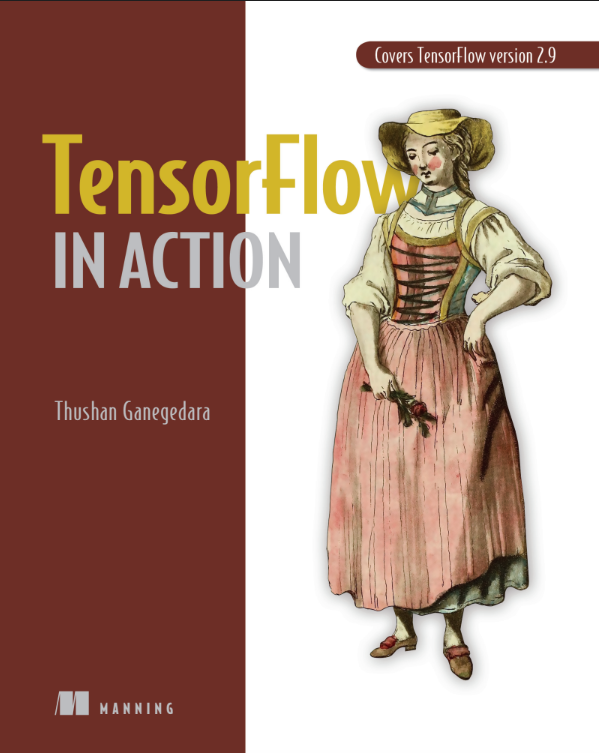

# TensorFlow in Action (Oleh Thushan Ganegedara)

Ini adalah rangkuman dari buku **"TensorFlow in Action"** yang mencakup TensorFlow versi 2.9. Buku ini berfungsi sebagai panduan komprehensif untuk membangun, melatih, dan menerapkan model *deep learning* untuk berbagai aplikasi dunia nyata.

---

## Ringkasan Bab

### Bagian 1: Dasar-dasar TensorFlow 2 dan Deep Learning

* **Bab 1: Dunia TensorFlow yang Menakjubkan**
    * Pengenalan kerangka kerja TensorFlow, perbandingan perangkat keras (CPU vs. GPU), dan panduan kapan harus menggunakan TensorFlow.

* **Bab 2: TensorFlow 2**
    * Membahas blok bangunan fundamental TensorFlow 2, termasuk `tf.Variable`, `tf.Tensor`, dan `tf.Operation`, serta komputasi dasar jaringan saraf.

* **Bab 3: Keras dan Pengambilan Data di TensorFlow 2**
    * Menjelaskan API Keras (Sequential, Functional, Sub-classing) untuk membangun model dan berbagai metode untuk memuat dan memanipulasi data.

* **Bab 4: Mencelupkan Jari ke dalam Deep Learning**
    * Implementasi praktis dari model *deep learning* dasar seperti *Fully Connected Networks* (Autoencoder), CNN, dan RNN.

* **Bab 5: Canggihnya Deep Learning: Transformers**
    * Pengenalan arsitektur Transformer, menyoroti komponen inti seperti *self-attention* dan *multi-head attention*.

### Bagian 2: Jaringan Deep di Dunia Nyata

* **Bab 6: Mengajari Mesin untuk Melihat: Klasifikasi Gambar dengan CNN**
    * Fokus pada klasifikasi gambar menggunakan CNN canggih seperti Inception Net v1, termasuk analisis data eksplorasi.

* **Bab 7: Mengajari Mesin untuk Melihat Lebih Baik: Meningkatkan CNN**
    * Membahas teknik-teknik untuk meningkatkan performa CNN, termasuk augmentasi data, *dropout*, *early stopping*, *transfer learning*, dan interpretabilitas model dengan Grad-CAM.

* **Bab 8: Membedakan Objek: Segmentasi Gambar**
    * Memperkenalkan tugas segmentasi gambar dan cara mengimplementasikan model canggih seperti DeepLabv3.

* **Bab 9: Natural Language Processing dengan TensorFlow: Analisis Sentimen**
    * Membahas tugas NLP analisis sentimen, mulai dari pemrosesan teks hingga membangun model LSTM.

* **Bab 10: Natural Language Processing dengan TensorFlow: Pemodelan Bahasa**
    * Fokus pada *language modeling*, membangun model berbasis GRU untuk menghasilkan teks, dan menggunakan teknik seperti *beam search*.

### Bagian 3: Jaringan Deep Tingkat Lanjut untuk Masalah Kompleks

* **Bab 11: Pembelajaran Sequence-to-Sequence: Bagian 1**
    * Membangun model *sequence-to-sequence* untuk tugas terjemahan mesin (Inggris ke Jerman).

* **Bab 12: Pembelajaran Sequence-to-Sequence: Bagian 2**
    * Meningkatkan model *sequence-to-sequence* dengan menambahkan mekanisme perhatian (*attention mechanism*) untuk performa yang lebih baik.

* **Bab 13: Transformers**
    * Memperluas pemahaman tentang Transformers dengan menggunakan model *pre-trained* seperti BERT dan pustaka Hugging Face untuk tugas klasifikasi spam dan tanya jawab.

* **Bab 14: TensorBoard: Kakak dari TensorFlow**
    * Panduan menggunakan TensorBoard untuk memvisualisasikan data, memantau pelatihan model, dan melakukan *profiling* kinerja.

* **Bab 15: TFX: MLOps dan Penerapan Model dengan TensorFlow**
    * Membahas cara membangun alur kerja *machine learning* berkualitas produksi menggunakan TFX (TensorFlow Extended), dari data hingga penerapan model melalui API.